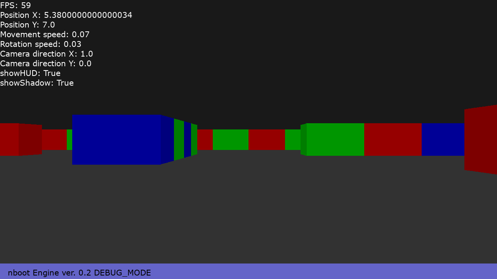

# nboot Engine - (A fork of [**"PyRay Raycasting Engine"**](https://github.com/oscr/PyRay))
#### The code and engine will be improved in the future.

# License

Released under [***MIT*** *License*](LICENSE)

# ver. 0.2 in dev!

</a>

